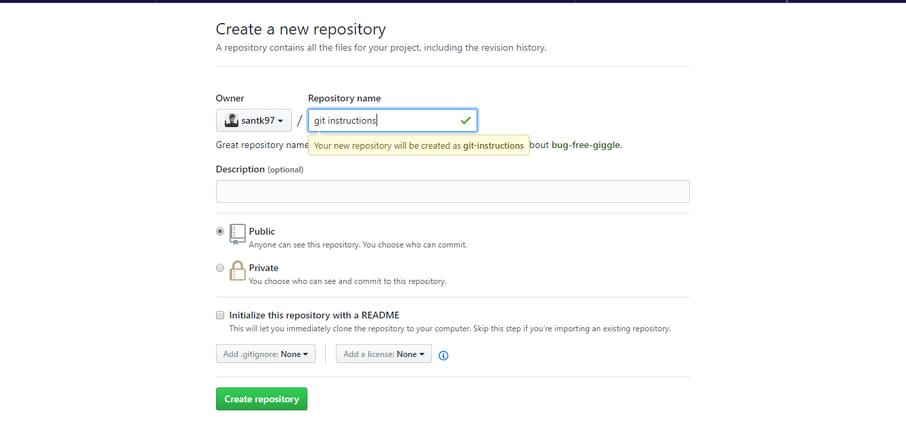
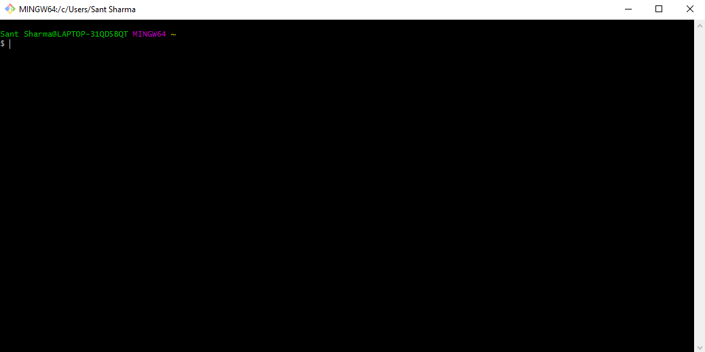
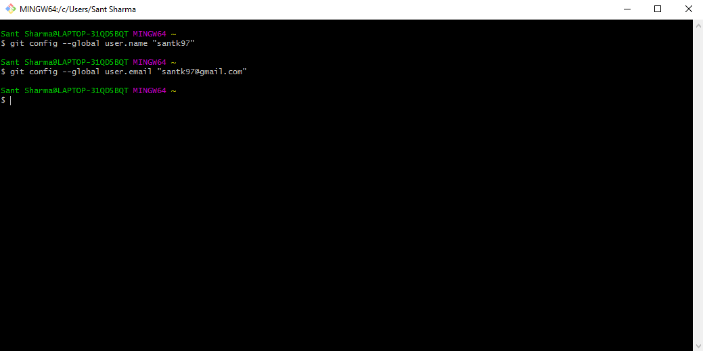
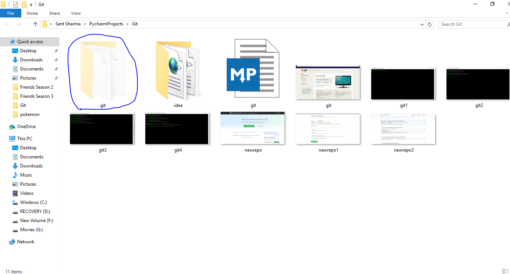

# Using Git and GitHub

## Pre-requisites
* A GitHub Acoount . If you don't have one make it [here](https://github.com/join)
* Git . Install Git [here]()


## Create new repository on Github

1. Open your Github account . You will see a page somewhat like this .

2. Click on **Start Project** Button to create a new project repository.
3. Alternatively you can also click on the **new repository** as shown in the bottom corner of the image .
4. Once you have clicked you'll be directed to this page.

5. Enter the repository name you want . Remembere there are some conventions to naming the repositories .
When you enter the name wait for a while until the green tick comes as shown in the image .
6. Then you can Click on the green **create Repository** button .
7. Then you will be redirected to the next page.

8. You have **succesfully** created a new repository on github .
9. Now we will see how we can **_push_** our data in the repository

## Using Git

1. Once you have installed Git on your system we can push our projects through it.
2. Open Git Bash and you will something like this.
 
3. The First two commands you need to run are just to get youself registered on Git.
```   
 git config --global.user "santk97"
    
 git config --global user.email "****@gmail.com"
```
    
*  **Make sure the username and email you enter are  github registered**(_not necessary but makes work easy_)

4. Now you need to direct your git to the destined folder .For that we use the ```cd "path"```  command .
   In the double quotes you need to enter the full path of your project .
   
   
5  Now that we have reached ou project folder the first thing  we need to do is  initialise out git in the project .
``` 
git init 
```   
Use this  command. It will make a .git folder in your project .



6 . Now that we have created the git folder . We will now add the files to be pushed , It can be done in two ways:
* Selectively
```python
git add filename
```
* All Files
```python
git add .
```
7 . We will use the    _**git add .**_ command
